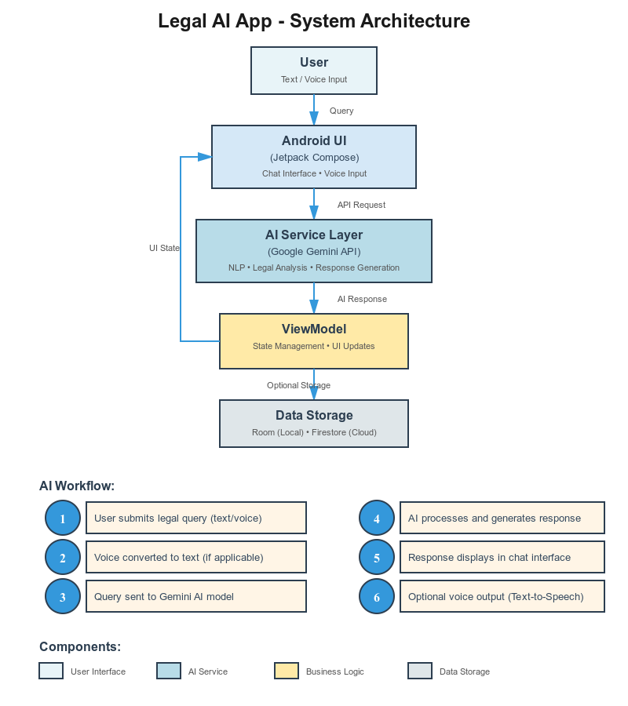

# ⚖️ Legal AI Assistant – Android Application

📋 **Table of Contents**
- [Overview](#-overview)
- [Problem Statement](#-problem-statement)
- [Key Features](#-key-features)
- [Screenshots](#-screenshots)
- [System Architecture](#-system-architecture)
- [Tech Stack](#-tech-stack)
- [System Requirements](#-system-requirements)
- [Installation & Setup](#-installation--setup)
- [Security & Privacy](#-security--privacy)
- [Future Enhancements](#-future-enhancements)
- [Academic Relevance](#-academic-relevance)
- [Project Structure](#-project-structure)
- [License](#-license)
- [Contributing](#-contributing)
- [Support](#-support)

---

## 📖 Overview
**Legal AI Assistant** is an innovative Android application designed to make legal information accessible to everyone, regardless of their background. By leveraging advanced Artificial Intelligence, the app provides users with instant answers to legal queries in simple, conversational language. Users can interact with the app using both text-based chat and voice commands, making it convenient and user-friendly.
The application aims to bridge the gap between complex legal jargon and everyday understanding by providing:
Interactive Chat Interface: Users can ask legal questions naturally, and the AI responds with clear and concise explanations.
Voice-Based Assistance: Speak your queries and receive spoken or text-based responses, enabling hands-free operation.
Comprehensive Legal Knowledge: Covers various areas of law such as civil, criminal, family, property, and consumer law.
Simplified Legal Concepts: Breaks down complicated legal terminology into plain, understandable language.
Real-Time Responses: Provides instant answers to help users make informed decisions without delays.
Resource Links: Suggests relevant legal documents, government portals, and reference materials for deeper understanding.
User-Friendly Interface: Designed with a simple and intuitive layout for easy navigation by users of all ages.
Secure and Private: Ensures user queries and data remain confidential and are not shared externally.
This app is ideal for individuals seeking quick legal guidance, students studying law, and anyone interested in understanding their rights and responsibilities without the need for a lawyer for basic inquiries.

<p align="center">
  
</p>

⚠️ **Disclaimer**  
This application provides legal information for educational and informational purposes only and does not replace professional legal advice. Always consult a licensed legal professional for official guidance.

---

## 📌 Problem Statement
Access to legal information is often limited due to:

- Complex legal language  
- High consultation costs  
- Lack of awareness of legal rights  
- Difficulty understanding legal procedures  

This application aims to bridge the gap between legal knowledge and the general public using AI technology.

---
## 🎥 App Demo Video

<p align="center">
  <a href="https://youtu.be/tNlRmMEVF8g" target="_blank">
    
  </a>
</p>

## 🚀 Key Features

### 🧠 AI-Powered Legal Chat
- Ask legal questions in natural language  
- Context-aware responses using **Google Gemini AI**  
- Simple and structured answers  

### 💬 Text-Based Chat Interface
- Modern UI built with **Jetpack Compose**  
- Persistent chat history  
- Smooth and responsive experience  

### 🎙 Voice Interaction
- Speech-to-Text for user queries  
- Text-to-Speech for AI responses  
- Hands-free usage support  

### 🔐 User Management (Optional)
- Firebase Authentication  
- Secure login and sessions  
- Cloud-based user data  

### 💾 Data Storage
- Room database for local storage  
- DataStore Preferences for settings  
- Firebase Firestore (optional cloud storage)  

---

## 🖼 Screenshots
<p align="center">
  
  
  
</p>
<p align="center">
  
  
  
</p>
<p align="center">
  
  
  
</p>
<p align="center">
  
</p>

---

## 🏗 System Architecture

### High-Level Architecture
<p align="center">
  
</p>
# Legal AI Chatbot

## System Architecture

<svg viewBox="0 0 1400 900" xmlns="http://www.w3.org/2000/svg">
  <!-- Paste the entire SVG code here -->
  <svg viewBox="0 0 1400 900" xmlns="http://www.w3.org/2000/svg">
  <defs>
    <!-- Gradients -->
    <linearGradient id="bg" x1="0%" y1="0%" x2="100%" y2="100%">
      <stop offset="0%" style="stop-color:#0f2027;stop-opacity:1" />
      <stop offset="50%" style="stop-color:#203a43;stop-opacity:1" />
      <stop offset="100%" style="stop-color:#2c5364;stop-opacity:1" />
    </linearGradient>
    <linearGradient id="card1" x1="0%" y1="0%" x2="100%" y2="100%">
      <stop offset="0%" style="stop-color:#11998e;stop-opacity:1" />
      <stop offset="100%" style="stop-color:#38ef7d;stop-opacity:1" />
    </linearGradient>
    <linearGradient id="card2" x1="0%" y1="0%" x2="100%" y2="100%">
      <stop offset="0%" style="stop-color:#fc466b;stop-opacity:1" />
      <stop offset="100%" style="stop-color:#3f5efb;stop-opacity:1" />
    </linearGradient>
    <linearGradient id="card3" x1="0%" y1="0%" x2="100%" y2="100%">
      <stop offset="0%" style="stop-color:#ffd89b;stop-opacity:1" />
      <stop offset="100%" style="stop-color:#19547b;stop-opacity:1" />
    </linearGradient>
    <linearGradient id="card4" x1="0%" y1="0%" x2="100%" y2="100%">
      <stop offset="0%" style="stop-color:#a8edea;stop-opacity:1" />
      <stop offset="100%" style="stop-color:#fed6e3;stop-opacity:1" />
    </linearGradient>
    <linearGradient id="card5" x1="0%" y1="0%" x2="100%" y2="100%">
      <stop offset="0%" style="stop-color:#ff6e7f;stop-opacity:1" />
      <stop offset="100%" style="stop-color:#bfe9ff;stop-opacity:1" />
    </linearGradient>
    <linearGradient id="center" x1="0%" y1="0%" x2="100%" y2="100%">
      <stop offset="0%" style="stop-color:#8e2de2;stop-opacity:1" />
      <stop offset="100%" style="stop-color:#4a00e0;stop-opacity:1" />
    </linearGradient>
    
    <!-- Filters -->
    <filter id="glow">
      <feGaussianBlur stdDeviation="4" result="coloredBlur"/>
      <feMerge>
        <feMergeNode in="coloredBlur"/>
        <feMergeNode in="SourceGraphic"/>
      </feMerge>
    </filter>
    <filter id="shadow">
      <feDropShadow dx="0" dy="6" stdDeviation="10" flood-opacity="0.4"/>
    </filter>
    
    <!-- Animated pulse -->
    <radialGradient id="pulse">
      <stop offset="0%" style="stop-color:#fff;stop-opacity:0.8" />
      <stop offset="100%" style="stop-color:#4a00e0;stop-opacity:0" />
    </radialGradient>
  </defs>
  
  <!-- Background -->
  <rect width="1400" height="900" fill="url(#bg)"/>
  
  <!-- Decorative circles -->
  <circle cx="100" cy="100" r="60" fill="#38ef7d" opacity="0.1"/>
  <circle cx="1300" cy="150" r="80" fill="#fc466b" opacity="0.1"/>
  <circle cx="1250" cy="750" r="100" fill="#ffd89b" opacity="0.1"/>
  <circle cx="150" cy="800" r="70" fill="#a8edea" opacity="0.1"/>
  
  <!-- Title with glow -->
  <g filter="url(#glow)">
    <text x="700" y="60" font-family="'Segoe UI', Arial, sans-serif" font-size="36" font-weight="bold" fill="#fff" text-anchor="middle">Legal AI Chatbot</text>
    <text x="700" y="95" font-family="'Segoe UI', Arial, sans-serif" font-size="20" fill="#a8edea" text-anchor="middle">Intelligent System Architecture with Voice Integration</text>
  </g>
  
  <!-- Central Hub -->
  <g filter="url(#shadow)">
    <circle cx="700" cy="450" r="120" fill="url(#center)" stroke="#fff" stroke-width="4"/>
    <circle cx="700" cy="450" r="110" fill="none" stroke="#fff" stroke-width="1" opacity="0.3" stroke-dasharray="5,5">
      <animateTransform attributeName="transform" type="rotate" from="0 700 450" to="360 700 450" dur="20s" repeatCount="indefinite"/>
    </circle>
    <text x="700" y="440" font-family="Arial, sans-serif" font-size="24" font-weight="bold" fill="#fff" text-anchor="middle">CORE</text>
    <text x="700" y="465" font-family="Arial, sans-serif" font-size="16" fill="#fff" text-anchor="middle">AI Engine</text>
    <text x="700" y="485" font-family="Arial, sans-serif" font-size="13" fill="#a8edea" text-anchor="middle">Gemini API</text>
  </g>
  
  <!-- Module 1: User Interface & Input -->
  <g filter="url(#shadow)">
    <rect x="80" y="180" width="280" height="200" rx="20" fill="url(#card1)"/>
    <circle cx="220" cy="220" r="25" fill="rgba(255,255,255,0.3)"/>
    <text x="220" y="230" font-size="30">📱</text>
    <text x="220" y="270" font-family="Arial, sans-serif" font-size="20" font-weight="bold" fill="#fff" text-anchor="middle">User Interface</text>
    <line x1="100" y1="290" x2="340" y2="290" stroke="rgba(255,255,255,0.3)" stroke-width="2"/>
    <text x="220" y="310" font-family="Arial, sans-serif" font-size="13" fill="#fff" text-anchor="middle">• Text Chat Input</text>
    <text x="220" y="330" font-family="Arial, sans-serif" font-size="13" fill="#fff" text-anchor="middle">• Voice Recognition</text>
    <text x="220" y="350" font-family="Arial, sans-serif" font-size="13" fill="#fff" text-anchor="middle">• Interactive Design</text>
    <text x="220" y="370" font-family="Arial, sans-serif" font-size="13" fill="#fff" text-anchor="middle">• Real-time Updates</text>
  </g>
  
  <!-- Connection line 1 -->
  <line x1="360" y1="280" x2="590" y2="380" stroke="#38ef7d" stroke-width="3" opacity="0.6"/>
  <circle cx="475" cy="330" r="5" fill="#38ef7d">
    <animate attributeName="cx" values="360;590" dur="2s" repeatCount="indefinite"/>
    <animate attributeName="cy" values="280;380" dur="2s" repeatCount="indefinite"/>
  </circle>
  
  <!-- Module 2: Voice Module (TTS) -->
  <g filter="url(#shadow)">
    <rect x="80" y="420" width="280" height="200" rx="20" fill="url(#card2)"/>
    <circle cx="220" cy="460" r="25" fill="rgba(255,255,255,0.3)"/>
    <text x="220" y="470" font-size="30">🎤</text>
    <text x="220" y="510" font-family="Arial, sans-serif" font-size="20" font-weight="bold" fill="#fff" text-anchor="middle">TTS Voice Module</text>
    <line x1="100" y1="530" x2="340" y2="530" stroke="rgba(255,255,255,0.3)" stroke-width="2"/>
    <text x="220" y="550" font-family="Arial, sans-serif" font-size="13" fill="#fff" text-anchor="middle">• Speech-to-Text</text>
    <text x="220" y="570" font-family="Arial, sans-serif" font-size="13" fill="#fff" text-anchor="middle">• Text-to-Speech</text>
    <text x="220" y="590" font-family="Arial, sans-serif" font-size="13" fill="#fff" text-anchor="middle">• Natural Voice Output</text>
    <text x="220" y="610" font-family="Arial, sans-serif" font-size="13" fill="#fff" text-anchor="middle">• Multi-language Support</text>
  </g>
  
  <!-- Connection line 2 -->
  <line x1="360" y1="520" x2="590" y2="480" stroke="#fc466b" stroke-width="3" opacity="0.6"/>
  <circle cx="475" cy="500" r="5" fill="#fc466b">
    <animate attributeName="cx" values="360;590" dur="2.5s" repeatCount="indefinite"/>
    <animate attributeName="cy" values="520;480" dur="2.5s" repeatCount="indefinite"/>
  </circle>
  
  <!-- Module 3: API Integration -->
  <g filter="url(#shadow)">
    <rect x="1040" y="180" width="280" height="200" rx="20" fill="url(#card3)"/>
    <circle cx="1180" cy="220" r="25" fill="rgba(255,255,255,0.3)"/>
    <text x="1180" y="230" font-size="30">🔌</text>
    <text x="1180" y="270" font-family="Arial, sans-serif" font-size="20" font-weight="bold" fill="#fff" text-anchor="middle">API Integration</text>
    <line x1="1060" y1="290" x2="1300" y2="290" stroke="rgba(255,255,255,0.3)" stroke-width="2"/>
    <text x="1180" y="310" font-family="Arial, sans-serif" font-size="13" fill="#fff" text-anchor="middle">• Retrofit Client</text>
    <text x="1180" y="330" font-family="Arial, sans-serif" font-size="13" fill="#fff" text-anchor="middle">• Kotlin Coroutines</text>
    <text x="1180" y="350" font-family="Arial, sans-serif" font-size="13" fill="#fff" text-anchor="middle">• Async Processing</text>
    <text x="1180" y="370" font-family="Arial, sans-serif" font-size="13" fill="#fff" text-anchor="middle">• Error Handling</text>
  </g>
  
  <!-- Connection line 3 -->
  <line x1="810" y1="380" x2="1040" y2="280" stroke="#ffd89b" stroke-width="3" opacity="0.6"/>
  <circle cx="925" cy="330" r="5" fill="#ffd89b">
    <animate attributeName="cx" values="810;1040" dur="2.2s" repeatCount="indefinite"/>
    <animate attributeName="cy" values="380;280" dur="2.2s" repeatCount="indefinite"/>
  </circle>
  
  <!-- Module 4: Legal Knowledge Base -->
  <g filter="url(#shadow)">
    <rect x="1040" y="420" width="280" height="200" rx="20" fill="url(#card4)"/>
    <circle cx="1180" cy="460" r="25" fill="rgba(255,255,255,0.3)"/>
    <text x="1180" y="472" font-size="30">⚖️</text>
    <text x="1180" y="510" font-family="Arial, sans-serif" font-size="20" font-weight="bold" fill="#2c5364" text-anchor="middle">Legal Knowledge</text>
    <line x1="1060" y1="530" x2="1300" y2="530" stroke="rgba(44,83,100,0.3)" stroke-width="2"/>
    <text x="1180" y="550" font-family="Arial, sans-serif" font-size="13" fill="#2c5364" text-anchor="middle">• Family Law Database</text>
    <text x="1180" y="570" font-family="Arial, sans-serif" font-size="13" fill="#2c5364" text-anchor="middle">• Criminal Law Cases</text>
    <text x="1180" y="590" font-family="Arial, sans-serif" font-size="13" fill="#2c5364" text-anchor="middle">• Labor Law Guidelines</text>
    <text x="1180" y="610" font-family="Arial, sans-serif" font-size="13" fill="#2c5364" text-anchor="middle">• Topic Categorization</text>
  </g>
  
  <!-- Connection line 4 -->
  <line x1="810" y1="480" x2="1040" y2="520" stroke="#a8edea" stroke-width="3" opacity="0.6"/>
  <circle cx="925" cy="500" r="5" fill="#a8edea">
    <animate attributeName="cx" values="810;1040" dur="2.8s" repeatCount="indefinite"/>
    <animate attributeName="cy" values="480;520" dur="2.8s" repeatCount="indefinite"/>
  </circle>
  
  <!-- Module 5: Session & State Management -->
  <g filter="url(#shadow)">
    <rect x="560" y="650" width="280" height="180" rx="20" fill="url(#card5)"/>
    <circle cx="700" cy="685" r="25" fill="rgba(255,255,255,0.3)"/>
    <text x="700" y="695" font-size="30">💾</text>
    <text x="700" y="730" font-family="Arial, sans-serif" font-size="20" font-weight="bold" fill="#fff" text-anchor="middle">Session Manager</text>
    <line x1="580" y1="745" x2="820" y2="745" stroke="rgba(255,255,255,0.3)" stroke-width="2"/>
    <text x="700" y="765" font-family="Arial, sans-serif" font-size="13" fill="#fff" text-anchor="middle">• ViewModel Architecture</text>
    <text x="700" y="785" font-family="Arial, sans-serif" font-size="13" fill="#fff" text-anchor="middle">• Context Preservation</text>
    <text x="700" y="805" font-family="Arial, sans-serif" font-size="13" fill="#fff" text-anchor="middle">• State Management</text>
  </g>
  
  <!-- Connection line 5 -->
  <line x1="700" y1="570" x2="700" y2="650" stroke="#ff6e7f" stroke-width="3" opacity="0.6"/>
  <circle cx="700" cy="610" r="5" fill="#ff6e7f">
    <animate attributeName="cy" values="570;650" dur="2s" repeatCount="indefinite"/>
  </circle>
  
  <!-- Bottom Info Cards -->
  <g filter="url(#shadow)">
    <rect x="80" y="660" width="200" height="160" rx="15" fill="rgba(17,153,142,0.2)" stroke="#11998e" stroke-width="2"/>
    <text x="180" y="690" font-family="Arial, sans-serif" font-size="16" font-weight="bold" fill="#38ef7d" text-anchor="middle">🛠️ Tech Stack</text>
    <text x="180" y="715" font-family="Arial, sans-serif" font-size="12" fill="#fff" text-anchor="middle">Kotlin + Android</text>
    <text x="180" y="735" font-family="Arial, sans-serif" font-size="12" fill="#fff" text-anchor="middle">Jetpack Compose</text>
    <text x="180" y="755" font-family="Arial, sans-serif" font-size="12" fill="#fff" text-anchor="middle">Retrofit + Coroutines</text>
    <text x="180" y="775" font-family="Arial, sans-serif" font-size="12" fill="#fff" text-anchor="middle">Google Gemini API</text>
    <text x="180" y="795" font-family="Arial, sans-serif" font-size="12" fill="#fff" text-anchor="middle">Android Studio</text>
  </g>
  
  <g filter="url(#shadow)">
    <rect x="310" y="660" width="200" height="160" rx="15" fill="rgba(252,70,107,0.2)" stroke="#fc466b" stroke-width="2"/>
    <text x="410" y="690" font-family="Arial, sans-serif" font-size="16" font-weight="bold" fill="#fc466b" text-anchor="middle">✨ Features</text>
    <text x="410" y="715" font-family="Arial, sans-serif" font-size="12" fill="#fff" text-anchor="middle">AI-Powered Responses</text>
    <text x="410" y="735" font-family="Arial, sans-serif" font-size="12" fill="#fff" text-anchor="middle">Voice Input/Output</text>
    <text x="410" y="755" font-family="Arial, sans-serif" font-size="12" fill="#fff" text-anchor="middle">Real-time Processing</text>
    <text x="410" y="775" font-family="Arial, sans-serif" font-size="12" fill="#fff" text-anchor="middle">Context-Aware Chat</text>
    <text x="410" y="795" font-family="Arial, sans-serif" font-size="12" fill="#fff" text-anchor="middle">Legal Categorization</text>
  </g>
  
  <g filter="url(#shadow)">
    <rect x="900" y="660" width="200" height="160" rx="15" fill="rgba(255,216,155,0.2)" stroke="#ffd89b" stroke-width="2"/>
    <text x="1000" y="690" font-family="Arial, sans-serif" font-size="16" font-weight="bold" fill="#ffd89b" text-anchor="middle">🎯 Benefits</text>
    <text x="1000" y="715" font-family="Arial, sans-serif" font-size="12" fill="#fff" text-anchor="middle">24/7 Availability</text>
    <text x="1000" y="735" font-family="Arial, sans-serif" font-size="12" fill="#fff" text-anchor="middle">Instant Responses</text>
    <text x="1000" y="755" font-family="Arial, sans-serif" font-size="12" fill="#fff" text-anchor="middle">Accessible Interface</text>
    <text x="1000" y="775" font-family="Arial, sans-serif" font-size="12" fill="#fff" text-anchor="middle">Cost-Effective</text>
    <text x="1000" y="795" font-family="Arial, sans-serif" font-size="12" fill="#fff" text-anchor="middle">Easy to Use</text>
  </g>
  
  <g filter="url(#shadow)">
    <rect x="1120" y="660" width="200" height="160" rx="15" fill="rgba(168,237,234,0.2)" stroke="#a8edea" stroke-width="2"/>
    <text x="1220" y="690" font-family="Arial, sans-serif" font-size="16" font-weight="bold" fill="#a8edea" text-anchor="middle">📊 Modules</text>
    <text x="1220" y="715" font-family="Arial, sans-serif" font-size="12" fill="#fff" text-anchor="middle">Chat Module</text>
    <text x="1220" y="735" font-family="Arial, sans-serif" font-size="12" fill="#fff" text-anchor="middle">UI Module</text>
    <text x="1220" y="755" font-family="Arial, sans-serif" font-size="12" fill="#fff" text-anchor="middle">API Module</text>
    <text x="1220" y="775" font-family="Arial, sans-serif" font-size="12" fill="#fff" text-anchor="middle">Knowledge Module</text>
    <text x="1220" y="795" font-family="Arial, sans-serif" font-size="12" fill="#fff" text-anchor="middle">TTS Module</text>
  </g>
  
  <!-- Pulse effect around center -->
  <circle cx="700" cy="450" r="130" fill="none" stroke="#fff" stroke-width="2" opacity="0.2">
    <animate attributeName="r" values="130;150;130" dur="3s" repeatCount="indefinite"/>
    <animate attributeName="opacity" values="0.2;0;0.2" dur="3s" repeatCount="indefinite"/>
  </circle>
  
  <!-- Data flow indicators -->
  <circle cx="590" cy="380" r="8" fill="#38ef7d" opacity="0.8"/>
  <circle cx="590" cy="480" r="8" fill="#fc466b" opacity="0.8"/>
  <circle cx="810" cy="380" r="8" fill="#ffd89b" opacity="0.8"/>
  <circle cx="810" cy="480" r="8" fill="#a8edea" opacity="0.8"/>
  
</svg>
</svg>

## Project Description
The Legal AI Chatbot is an Android application...

### AI Workflow
1. User submits a legal query (text or voice)  
2. Voice input is converted to text  
3. Query is sent to the Gemini AI model  
4. AI processes and generates a response  
5. Response appears in the chat interface  
6. Optional voice output via Text-to-Speech  

---

## 🛠 Tech Stack

### Android Development
- **Language:** Kotlin (Primary), Java (Limited)  
- **UI:** Jetpack Compose (Material 3)  
- **Architecture:** MVVM  
- **State Management:** ViewModel + StateFlow  

### AI & Networking
- Retrofit & OkHttp  
- Google Gemini AI SDK  

### Storage & Backend
- Room Database  
- DataStore Preferences  
- Firebase Authentication & Firestore (Optional)  

### Other Libraries
- Coil (Image Loading)  
- Android Speech API  
- Android Text-to-Speech Engine  

---

## 📋 System Requirements

### Development Environment
- Android Studio Narwhal 3 Feature Drop (2025.1.3+)  
- JDK 17 or higher  

### Android Configuration
- **minSdk:** 26 (Android 8.0)  
- **targetSdk:** 34 (Android 14)  
- **compileSdk:** 34  

---

## ⚙️ Installation & Setup

### 1️⃣ Clone the Repository
```bash
git clone https://github.com/Ahsaniss/Legal-AI-Assistant.git
cd Legal-AI-Assistant
2️⃣ Configure Gemini API Key
Create or edit local.properties in the root directory:

properties

GEMINI_API_KEY=YOUR_API_KEY_HERE
⚠️ Do not commit local.properties to GitHub

3️⃣ Firebase Setup (Optional)
Create a Firebase project

Add Android app with correct applicationId

Download google-services.json

Place it inside the app/ directory

4️⃣ Build & Run
Open project in Android Studio

Sync Gradle files

Build the project

Run on emulator or physical device

🔐 Security & Privacy
API keys stored securely in local.properties

Firebase security rules protect user data

No sensitive legal data stored without consent

Encrypted AI API communication

🔮 Future Enhancements
Legal document upload & analysis (PDF, DOCX)

Multi-language support

Offline AI fallback

Lawyer / Client role-based access

Court case tracking system

Jurisdiction-specific AI tuning

🎓 Academic Relevance
This project demonstrates:

AI integration in mobile applications

Voice-based human–computer interaction

Secure Android app architecture (MVVM)

Real-world legal problem solving

Suitable for:

Final Year Projects (FYP)

Android & AI portfolios

Research and internship evaluations

🗂 Project Structure
bash
Copy code
Legal-AI-Assistant/
├── app/
│   ├── src/main/java/com/example/legalaiassistant/
│   │   ├── data/           # Data layer
│   │   ├── domain/         # Business logic
│   │   ├── presentation/   # UI & ViewModels
│   │   ├── di/             # Dependency Injection
│   │   └── utils/          # Utilities
│   ├── res/
│   └── AndroidManifest.xml
├── screenshots/
├── build.gradle.kts
├── settings.gradle.kts
└── README.md
📄 License
All Rights Reserved © 2025 Muhammad Ahsan Raza

🤝 Contributing
This is a personal project. Suggestions and constructive feedback are welcome while respecting the project scope and license.

📞 Support
Check existing GitHub issues

Review project documentation

Ensure proper API key configuration
---


